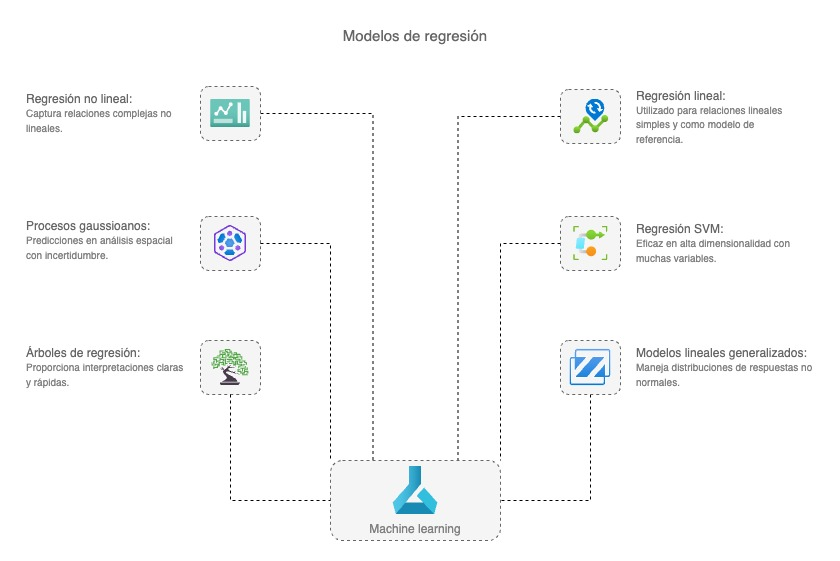

# Quickstart Regression Model

El machine learning ha conquistado la industria y hoy está en el centro de la gran magia de los productos de alta tecnología; se ha infiltrado silenciosamente en nuestra vida cotidiana, optimizando lo invisible y personalizando lo esencial. En este repositorio, profundizaremos en los modelos de regresión diseñados para predecir valores numéricos continuos. Este proyecto tiene como objetivo proporcionar un **punto de partida rápido y sencillo, sin perder de vista lo más avanzado del tema,** para comprender e implementar modelos de regresión utilizando **Python**, la popular librería scikit-learn y las diferentes tecnologías de vanguardia. 

## Regresión
Las técnicas de aprendizaje supervisado (supervised machine learning) implican entrenar un modelo para operar sobre un conjunto de características (features) y predecir una etiqueta (label), utilizando un conjunto de datos que incluye valores ya conocidos de dicha etiqueta. El proceso de entrenamiento ajusta (fits) las características a las etiquetas conocidas para definir una función general que pueda aplicarse a nuevas características cuyas etiquetas son desconocidas y así predecirlas. Esta función puede representarse así, donde *y* es la etiqueta que queremos predecir y *x* son las características que el modelo usa para predecirla:

$$y = f(x)$$  

En la mayoría de los casos, *x* es en realidad un *vector* formado por múltiples valores de características, por lo que, para ser más precisos, la función podría expresarse así:  

$$y = f([x_1, x_2, x_3, ...])$$  

El objetivo del entrenamiento del modelo es encontrar una función que realice algún tipo de cálculo con los valores de *x* para producir el resultado *y*. Esto se logra aplicando un *algoritmo* de aprendizaje automático que intenta ajustar los valores de *x* a un cálculo que produzca *y* con una precisión razonable para todos los casos en el conjunto de datos de entrenamiento.

Existen muchos algoritmos de aprendizaje supervisado, que pueden dividirse en dos grandes categorías:  

- **Algoritmos de *regresión***: Predicen un valor *y* que es numérico, como el precio de una casa o el número de transacciones de venta.  
- **Algoritmos de *clasificación***: Predicen a qué categoría (o *clase*) pertenece una observación. El valor *y* en un modelo de clasificación es un vector de valores de probabilidad entre 0 y 1 (uno por cada clase), que indica la probabilidad de que la observación pertenezca a dicha clase.  

En este (*repositorio*), nos centraremos en la *regresión* y sus algoritmos más comunes, usando un ejemplo basado en un estudio real en el que se recopilaron datos de un sistema de bicicletas compartidas para predecir el número de alquileres en función de la estacionalidad y las condiciones climáticas. Utilizaremos una versión simplificada del conjunto de datos de ese estudio.

##  Algoritmos de regresión comunes

